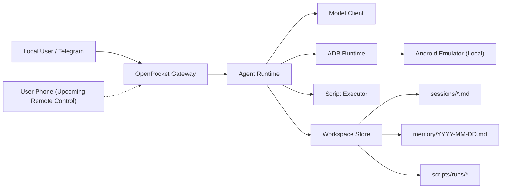

# OpenPocket

[](https://nodejs.org/)
[](https://www.typescriptlang.org/)
[](#architecture)
[](./frontend/index.md)

OpenPocket is a local emulator-first phone-use agent runtime for Android automation.

It combines a practical CLI, a Telegram gateway, model-driven planning, and adb-based action execution with auditable persistence:

`Telegram / CLI -> Gateway -> Agent Runtime -> Model Client -> adb -> Android Emulator`

## Why OpenPocket

- **No main-phone resource usage**: tasks run on a local emulator, not on your physical phone.
- **Local execution boundary**: device control stays local through adb instead of a hosted cloud phone service.
- **Auditable runs**: sessions, daily memory, screenshots, and script artifacts are persisted.
- **Dual control modes**: direct local emulator control and agent-driven control in one runtime.
- **Provider flexibility**: model endpoint fallback and profile-based config.
- **Operator-friendly**: setup wizard, heartbeat, cron scheduler, and controlled run-loop.
- **macOS control panel**: optional native menu bar app for operational control.

## Who It Is For

OpenPocket targets both developers and everyday users who need repeatable mobile task execution.

Representative scenarios:

- shopping workflows
- entertainment app routines
- social interaction support
- recurring mobile actions that benefit from automation

Near-term roadmap includes remote phone access to the local runtime for human-in-the-loop control.

## Key Capabilities

- Emulator control: `start`, `stop`, `status`, `list-avds`, `hide`, `show`, `screenshot`
- Agent actions: `tap`, `swipe`, `type`, `keyevent`, `launch_app`, `shell`, `run_script`, `request_human_auth`, `wait`, `finish`
- Gateway modes: Telegram polling, chat/task routing, `/stop`, `/reset`, `/restart`, `/cronrun`, `/run`, `/auth`
- Telegram command menu: auto-configured on `gateway start` (`setMyCommands` + menu button)
- Human-auth connectivity: local self-hosted relay with optional ngrok tunnel auto-start in gateway
- Runtime services: heartbeat monitoring, cron job execution, signal-aware gateway restarts
- Script safety: allowlist, deny patterns, timeout, output limits, and run archives
- Workspace memory: per-task session files + daily memory timeline

## Architecture



## Quick Start

### 1. Prerequisites

- Node.js 20+
- Android SDK emulator + platform-tools (`adb`)
- At least one Android AVD
- Model API key (for your selected model profile)
- Telegram bot token (if using gateway)

### 2. Option A: Use the npm package (no source code required)

```bash
npm install -g openpocket
openpocket onboard
```

If you use the native macOS panel, install the release package from:

- [OpenPocket Releases](https://github.com/SergioChan/openpocket/releases)

Then start the panel:

```bash
openpocket panel start
```

### 3. Option B: Use a local source clone (for contributors)

```bash
git clone git@github.com:SergioChan/openpocket.git
cd openpocket
npm install
npm run build
./openpocket onboard
```

`./openpocket` runs `dist/cli.js` when present and falls back to `tsx src/cli.ts` in local dev installs.

`openpocket onboard` automatically verifies Android runtime dependencies:

1. If local tools are already installed, dependency installation is skipped.
2. If tools are missing on macOS, OpenPocket tries automatic installation (Homebrew, Java 17+ runtime, Android SDK packages, and default AVD bootstrap).
3. If an existing AVD is already present, OpenPocket reuses it and skips heavy system-image bootstrap.

You can skip this step in CI/tests with:

```bash
export OPENPOCKET_SKIP_ENV_SETUP=1
```

### 4. Start runtime

For npm package install:

```bash
openpocket emulator start
openpocket gateway start
```

For local source clone:

```bash
./openpocket emulator start
./openpocket gateway start
```

### 5. Optional: install a user-local command

```bash
./openpocket install-cli
```

This installs `~/.local/bin/openpocket` and updates shell rc files when needed.

## Configuration

Primary config file:

- `~/.openpocket/config.json` (or `OPENPOCKET_HOME/config.json`)

Example config template:

- [`openpocket.config.example.json`](./openpocket.config.example.json)

Common environment variables:

```bash
export OPENAI_API_KEY="<your_openai_key>"
export OPENROUTER_API_KEY="<your_openrouter_key>"
export AUTOGLM_API_KEY="<your_autoglm_key>"
export TELEGRAM_BOT_TOKEN="<your_telegram_bot_token>"
export ANDROID_SDK_ROOT="$HOME/Library/Android/sdk"
export OPENPOCKET_HOME="$HOME/.openpocket"
```

## CLI Surface

Command prefix by install mode:

- npm package install: use `openpocket ...`
- local source clone: use `./openpocket ...` (or `openpocket ...` after `install-cli`)

```bash
./openpocket --help
./openpocket install-cli
./openpocket onboard
./openpocket config-show
./openpocket emulator start
./openpocket emulator status
./openpocket agent --model gpt-5.2-codex "Open Chrome and search weather"
./openpocket script run --text "echo hello"
./openpocket telegram setup
./openpocket skills list
./openpocket gateway start
./openpocket panel start
```

`./openpocket human-auth-relay start ...` remains available as an optional standalone debug mode.

Legacy aliases still work (deprecated): `openpocket init`, `openpocket setup`.

`openpocket panel start` on macOS uses this order:

1. Open an already-installed panel app from `/Applications` or `~/Applications`.
2. If running from a source clone with `apps/openpocket-menubar`, build and launch from source.
3. If neither is available (typical npm install), open GitHub Releases and guide PKG installation.

## Documentation

### Where the frontend is

The documentation frontend is implemented in this repository:

- Site source: [`/frontend`](./frontend)
- VitePress config: [`/frontend/.vitepress/config.mjs`](./frontend/.vitepress/config.mjs)
- Custom homepage: [`/frontend/index.md`](./frontend/index.md)
- Custom theme styles: [`/frontend/.vitepress/theme/custom.css`](./frontend/.vitepress/theme/custom.css)

### Documentation Website

- Start local docs server:

```bash
npm run docs:dev
```

- Build static docs:

```bash
npm run docs:build
```

- Build for Vercel (root base path):

```bash
npm run docs:build:vercel
```

- Preview built docs:

```bash
npm run docs:preview
```

### Deployment options

- Vercel config: [`vercel.json`](./vercel.json)
- Deployment guide: [`/frontend/get-started/deploy-docs.md`](./frontend/get-started/deploy-docs.md)

### Docs entry points

- [Docs Home](./frontend/index.md)
- [Documentation Hubs](./frontend/hubs.md)
- [Get Started](./frontend/get-started/index.md)
- [Project Blueprint](./frontend/concepts/project-blueprint.md)
- [Reference](./frontend/reference/index.md)
- [Ops Runbook](./frontend/ops/runbook.md)

## Repository Structure

- [`/src`](./src): runtime source code (agent, gateway, device, tools, onboarding)
- [`/frontend`](./frontend): standalone frontend site (homepage + docs)
- [`/test`](./test): runtime contract and integration tests
- [`/apps/openpocket-menubar`](./apps/openpocket-menubar): native macOS menu bar control panel
- [`/dist`](./dist): build output

## Development

Run checks:

```bash
npm run check
npm test
```

## Contributing

- Keep code, docs, comments, and tests in English.
- Prefer behavior-driven changes with matching tests.
- Document new runtime capabilities under `/frontend` in the relevant hub.

## Security and Safety Notes

- `run_script` execution is guarded by an allowlist and deny patterns.
- Timeout and output truncation are enforced per script run.
- Local paths are sanitized/redacted in Telegram-facing outputs.

## License

[MIT](./LICENSE)
