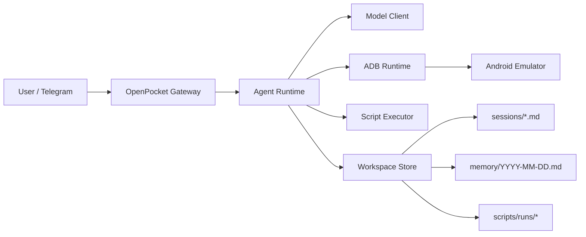

# OpenPocket

[](https://nodejs.org/)
[](https://www.typescriptlang.org/)
[](#architecture)
[](./docs/index.md)

OpenPocket is a local-first phone-use agent runtime for Android automation.

It combines a practical CLI, a Telegram gateway, model-driven planning, and adb-based action execution with auditable persistence:

`Telegram / CLI -> Gateway -> Agent Runtime -> Model Client -> adb -> Android Emulator`

## Why OpenPocket

- **Local execution boundary**: device control stays local through adb.
- **Auditable runs**: sessions, daily memory, screenshots, and script artifacts are persisted.
- **Provider flexibility**: model endpoint fallback and profile-based config.
- **Operator-friendly**: setup wizard, heartbeat, cron scheduler, and controlled run-loop.
- **macOS control panel**: optional native menu bar app for operational control.

## Key Capabilities

- Emulator control: `start`, `stop`, `status`, `list-avds`, `hide`, `show`, `screenshot`
- Agent actions: `tap`, `swipe`, `type`, `keyevent`, `launch_app`, `shell`, `run_script`, `wait`, `finish`
- Gateway modes: Telegram polling, chat/task routing, `/stop`, `/cronrun`, `/run`
- Runtime services: heartbeat monitoring, cron job execution, signal-aware gateway restarts
- Script safety: allowlist, deny patterns, timeout, output limits, and run archives
- Workspace memory: per-task session files + daily memory timeline

## Architecture



## Quick Start

### 1. Prerequisites

- Node.js 20+
- Android SDK emulator + platform-tools (`adb`)
- At least one Android AVD
- Model API key (for your selected model profile)
- Telegram bot token (if using gateway)

### 2. Install and initialize (npm package)

After publishing to npm, use:

```bash
npm install -g openpocket
openpocket init
openpocket onboard
```

### 3. Install and initialize (local clone, no global install)

```bash
cd /Users/sergiochan/Documents/GitHub/phone-use-agent
npm install
./openpocket init
./openpocket onboard
```

`./openpocket` automatically runs `dist/cli.js` when present, and falls back to `tsx src/cli.ts` in dev installs.

### 4. Start runtime

Use `openpocket ...` (npm global install) or `./openpocket ...` (local clone):

```bash
openpocket emulator start
openpocket gateway start
```

### 5. Command resolution and PATH behavior

- `init` / `setup` / `onboard` do **not** modify your shell config or PATH.
- Use `openpocket ...` when installed from npm globally.
- Use `./openpocket ...` when running from a local cloned repository.
- `openpocket install-cli` is optional and explicit; run it only if you want a user-local launcher under `~/.local/bin/openpocket`.

## Configuration

Primary config file:

- `~/.openpocket/config.json` (or `OPENPOCKET_HOME/config.json`)

Example config template:

- [`openpocket.config.example.json`](./openpocket.config.example.json)

Common environment variables:

```bash
export OPENAI_API_KEY="<your_openai_key>"
export OPENROUTER_API_KEY="<your_openrouter_key>"
export AUTOGLM_API_KEY="<your_autoglm_key>"
export TELEGRAM_BOT_TOKEN="<your_telegram_bot_token>"
export ANDROID_SDK_ROOT="$HOME/Library/Android/sdk"
export OPENPOCKET_HOME="$HOME/.openpocket"
```

## CLI Surface

Use `openpocket ...` if installed via npm global package, or `./openpocket ...` in a local clone.

```bash
openpocket --help
openpocket init
openpocket install-cli
openpocket setup
openpocket onboard
openpocket config-show
openpocket emulator start
openpocket emulator status
openpocket agent --model gpt-5.2-codex "Open Chrome and search weather"
openpocket script run --text "echo hello"
openpocket skills list
openpocket gateway start
openpocket panel start
```

## Documentation

### Documentation Website

- Start local docs server:

```bash
npm run docs:dev
```

- Build static docs:

```bash
npm run docs:build
```

- Preview built docs:

```bash
npm run docs:preview
```

### Docs entry points

- [Docs Home](./docs/index.md)
- [Documentation Hubs](./docs/hubs.md)
- [Get Started](./docs/get-started/README.md)
- [Reference](./docs/reference/README.md)
- [Ops Runbook](./docs/ops/runbook.md)

## Repository Structure

- [`/src`](./src): runtime source code (agent, gateway, device, tools, onboarding)
- [`/docs`](./docs): project documentation + VitePress site source
- [`/test`](./test): runtime contract and integration tests
- [`/apps/openpocket-menubar`](./apps/openpocket-menubar): native macOS menu bar control panel
- [`/dist`](./dist): build output

## Development

Run checks:

```bash
npm run check
npm test
```

## Contributing

- Keep code, docs, comments, and tests in English.
- Prefer behavior-driven changes with matching tests.
- Document new runtime capabilities under `/docs` in the relevant hub.

## Security and Safety Notes

- `run_script` execution is guarded by an allowlist and deny patterns.
- Timeout and output truncation are enforced per script run.
- Local paths are sanitized/redacted in Telegram-facing outputs.

## License

License file is not finalized yet for this repository.
Add a license before public distribution.
