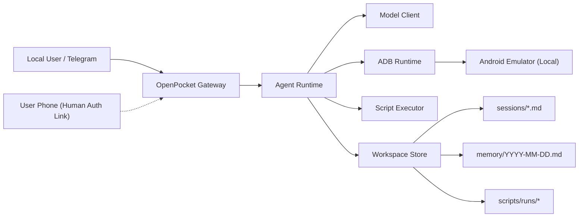

# OpenPocket

[](https://nodejs.org/)
[](https://www.typescriptlang.org/)
[](#architecture)
[](./frontend/index.md)

An Intelligent Phone That Never Sleeps.  
OpenPocket runs an always-on agent phone locally, with privacy first.

## Quick Start

### 1. Prerequisites

- Node.js 20+
- Android SDK Emulator + platform-tools (`adb`)
- At least one Android AVD
- API key for your selected model profile
- Telegram bot token (for gateway mode)

### 2. Install

#### Option A: npm package (recommended for end users)

```bash
npm install -g openpocket
openpocket onboard
openpocket gateway start
```

#### Option B: source clone (recommended for contributors)

```bash
git clone git@github.com:SergioChan/openpocket.git
cd openpocket
npm install
npm run build
./openpocket onboard
./openpocket gateway start
```

### 3. What `onboard` configures

The onboarding wizard is interactive and persists progress to:

- `~/.openpocket/state/onboarding.json`

It walks through:

1. User consent for local runtime and data boundaries.
2. Model profile selection and API key source (env or local config).
3. Telegram setup (token source and chat allowlist policy).
4. Emulator startup and manual Play Store/Gmail verification.
5. Human-auth bridge mode:
   - disabled
   - local LAN relay
   - local relay + ngrok tunnel (remote approval link)

### 4. Run your first task

```bash
openpocket agent --model gpt-5.2-codex "Open Chrome and search weather"
```

Or send plain text directly to your Telegram bot after `gateway start`.

## Key Capabilities

- **Local emulator-first runtime**: execution stays on your machine via adb, not a hosted cloud phone.
- **Always-on agent loop**: model-driven planning + action execution over Android UI primitives.
- **Remote authorization proxy (human-auth relay)**:
  - agent can emit `request_human_auth` when blocked by real-device checks
  - gateway sends one-time approval link and manual fallback commands
  - local relay can auto-start with optional ngrok tunnel
- **Dual control modes**: direct user control and agent control on the same emulator runtime.
- **Production-style gateway operations**: Telegram command menu bootstrap, heartbeat, cron jobs, restart loop, safe stop.
- **Script safety controls**: allowlist + deny patterns + timeout + output caps + run artifacts.
- **Auditable persistence**: task sessions, daily memory, screenshots, and script archives.

## Product Scenarios

OpenPocket is built for both developers and everyday users.

Typical scenarios include:

- shopping flows across mobile apps
- entertainment routines and repetitive app navigation
- social task assistance with human-in-the-loop approvals
- recurring mobile actions that benefit from automation and traceability

## Runtime Flow

`Telegram / CLI -> Gateway -> Agent Runtime -> Model Client -> adb -> Android Emulator`

## Architecture



## Configuration

Primary config file:

- `~/.openpocket/config.json` (or `OPENPOCKET_HOME/config.json`)

Example config template:

- [`openpocket.config.example.json`](./openpocket.config.example.json)

Common environment variables:

```bash
export OPENAI_API_KEY="<your_openai_key>"
export OPENROUTER_API_KEY="<your_openrouter_key>"
export AUTOGLM_API_KEY="<your_autoglm_key>"
export TELEGRAM_BOT_TOKEN="<your_telegram_bot_token>"
export OPENPOCKET_HUMAN_AUTH_KEY="<your_human_auth_relay_key>"
export NGROK_AUTHTOKEN="<your_ngrok_token>"
export ANDROID_SDK_ROOT="$HOME/Library/Android/sdk"
export OPENPOCKET_HOME="$HOME/.openpocket"
```

## CLI Surface

Command prefix by install mode:

- npm package install: use `openpocket ...`
- local source clone: use `./openpocket ...` (or `openpocket ...` after `install-cli`)

```bash
./openpocket --help
./openpocket install-cli
./openpocket onboard
./openpocket config-show
./openpocket emulator start
./openpocket emulator status
./openpocket agent --model gpt-5.2-codex "Open Chrome and search weather"
./openpocket script run --text "echo hello"
./openpocket telegram setup
./openpocket skills list
./openpocket gateway start
./openpocket human-auth-relay start
./openpocket panel start
```

`human-auth-relay start` is mainly a standalone debug mode. In normal gateway usage, local relay/tunnel startup is handled automatically from config.

Legacy aliases still work (deprecated): `openpocket init`, `openpocket setup`.

`openpocket panel start` on macOS uses this order:

1. Open an already-installed panel app from `/Applications` or `~/Applications`.
2. If running from a source clone with `apps/openpocket-menubar`, build and launch from source.
3. If neither is available (typical npm install), open GitHub Releases and guide PKG installation.

## Human Authorization Modes

OpenPocket supports three human-auth configurations:

1. **Disabled**: no relay, no remote approval.
2. **LAN relay**: local relay exposed on LAN for phone access in the same network.
3. **Relay + ngrok**: gateway auto-starts local relay and ngrok, then issues public approval links.

When the agent emits `request_human_auth`, Telegram users can:

- tap the web approval link
- or run fallback commands:
  - `/auth approve <request-id> [note]`
  - `/auth reject <request-id> [note]`

## Documentation

### Where the frontend is

The documentation frontend is implemented in this repository:

- Site source: [`/frontend`](./frontend)
- VitePress config: [`/frontend/.vitepress/config.mjs`](./frontend/.vitepress/config.mjs)
- Custom homepage: [`/frontend/index.md`](./frontend/index.md)
- Custom theme styles: [`/frontend/.vitepress/theme/custom.css`](./frontend/.vitepress/theme/custom.css)

### Documentation Website

- Start local docs server:

```bash
npm run docs:dev
```

- Build static docs:

```bash
npm run docs:build
```

- Build for Vercel (root base path):

```bash
npm run docs:build:vercel
```

- Preview built docs:

```bash
npm run docs:preview
```

### Deployment options

- Vercel config: [`vercel.json`](./vercel.json)
- Deployment guide: [`/frontend/get-started/deploy-docs.md`](./frontend/get-started/deploy-docs.md)

### Docs entry points

- [Docs Home](./frontend/index.md)
- [Documentation Hubs](./frontend/hubs.md)
- [Get Started](./frontend/get-started/index.md)
- [Project Blueprint](./frontend/concepts/project-blueprint.md)
- [Reference](./frontend/reference/index.md)
- [Ops Runbook](./frontend/ops/runbook.md)

## Repository Structure

- [`/src`](./src): runtime source code (agent, gateway, device, tools, onboarding)
- [`/frontend`](./frontend): standalone frontend site (homepage + docs)
- [`/test`](./test): runtime contract and integration tests
- [`/apps/openpocket-menubar`](./apps/openpocket-menubar): native macOS menu bar control panel
- [`/dist`](./dist): build output

## Development

Run checks:

```bash
npm run check
npm test
```

## Contributing

- Prefer behavior-driven changes with matching tests.
- Document new runtime capabilities under `/frontend` in the relevant hub.

## Security and Safety Notes

- `run_script` execution is guarded by an allowlist and deny patterns.
- Timeout and output truncation are enforced per script run.
- Local paths are sanitized/redacted in Telegram-facing outputs.

## License

[MIT](./LICENSE)
