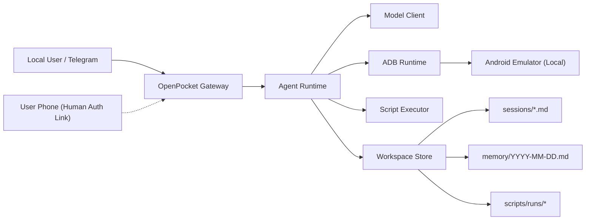

# OpenPocket

[](https://nodejs.org/)
[](https://www.typescriptlang.org/)
[](#architecture)
[](./frontend/index.md)

An Intelligent Phone That Never Sleeps.  
OpenPocket runs an always-on agent phone locally, with privacy first.

## Current Development Progress

Status snapshot (February 2026):

### Implemented and usable today

- Local Android emulator runtime driven by CLI + Telegram gateway.
- Interactive onboarding (`openpocket onboard`) for consent, model/API key setup, Telegram setup, emulator boot, and human-auth mode selection.
- Human authorization relay bridge with:
  - in-chat manual fallback (`/auth approve|reject`)
  - one-time web approval links
  - optional local ngrok tunnel auto-start
- Script execution safety controls (allowlist, deny patterns, timeout, output limits).
- Workspace persistence for sessions, daily memory logs, screenshots, and script run artifacts.
- Gateway operational loop with heartbeat, cron triggers, and restart handling.

### In progress and partially complete

- Human-auth remote flow reliability and UX hardening.
- Runtime architecture and docs stabilization for broader open-source adoption.

### Priority gaps to close

- A stronger long-horizon memory system.
- Phone-use-specific prompt engineering and evaluation.
- Cross-platform runtime/web-dashboard support beyond macOS-first workflows.

## Quick Start

### 1. Prerequisites

- Node.js 20+
- Android SDK Emulator + platform-tools (`adb`)
- At least one Android AVD
- API key for your selected model profile
- Telegram bot token (for gateway mode)

### 2. Install

#### Option A: npm package (recommended for end users)

```bash
npm install -g openpocket
openpocket onboard
openpocket gateway start
```

#### Option B: source clone (recommended for contributors)

```bash
git clone git@github.com:SergioChan/openpocket.git
cd openpocket
npm install
npm run build
./openpocket onboard
./openpocket gateway start
```

### 3. What `onboard` configures

The onboarding wizard is interactive and persists progress to:

- `~/.openpocket/state/onboarding.json`

It walks through:

1. User consent for local runtime and data boundaries.
2. Model profile selection and API key source (env or local config).
3. Telegram setup (token source and chat allowlist policy).
4. Emulator startup and manual Play Store/Gmail verification.
5. Human-auth bridge mode:
   - disabled
   - local LAN relay
   - local relay + ngrok tunnel (remote approval link)

### 4. Run your first task

```bash
openpocket agent --model gpt-5.2-codex "Open Chrome and search weather"
```

Or send plain text directly to your Telegram bot after `gateway start`.

## Key Capabilities

- **Local emulator-first runtime**: execution stays on your machine via adb, not a hosted cloud phone.
- **Always-on agent loop**: model-driven planning + action execution over Android UI primitives.
- **Remote authorization proxy (human-auth relay)**:
  - agent can emit `request_human_auth` when blocked by real-device checks
  - gateway sends one-time approval link and manual fallback commands
  - local relay can auto-start with optional ngrok tunnel
- **Dual control modes**: direct user control and agent control on the same emulator runtime.
- **Production-style gateway operations**: Telegram command menu bootstrap, heartbeat, cron jobs, restart loop, safe stop.
- **Script safety controls**: allowlist + deny patterns + timeout + output caps + run artifacts.
- **Auditable persistence**: task sessions, daily memory, screenshots, and script archives.

## Roadmap

### R1. Memory System (Core Intelligence)

Build a robust memory layer for long-horizon tasks:

- semantic retrieval and episodic memory
- memory compaction/summarization
- conflict resolution and freshness policies
- memory-aware planning loops

### R2. Prompt Engineering for Phone-Use

Establish a production prompt stack tailored to mobile workflows:

- phone-specific action planning prompts
- app-state-aware prompting templates
- failure-recovery prompting
- prompt eval suite and regression benchmarks

### R3. Multi-OS Runtime and Control Surface

Expand from macOS-first to full platform support:

- Linux (Ubuntu and headless server scenarios)
- Windows support
- dashboard portability strategy:
  - primary target: local/remote Web UI
  - fallback: native OS-specific control apps only when needed

### R4. Real Device Authorization + Permission Isolation

Strengthen system-level authorization architecture:

- iOS and Android real-device compatibility
- cross-device authorization where real phone and emulator differ
- secure remote port authorization flow
- strict permission boundary between real phone and emulator runtime

### R5. Skill System Maturity

Evolve from static skills to dynamic capability generation:

- agent-authored skills/code generation
- safe execution sandbox and policy gates
- skill validation, caching, and reuse

### R6. Multi-Channel Control Integrations

Go beyond Telegram and support more communication entry points:

- international platforms: Discord, WhatsApp, iMessage, Messenger
- China-focused platforms: WeChat, QQ
- unified channel abstraction for message, auth, and task control

### R7. Account Login UX and Session Authorization

Improve real-world login workflows after app installation:

- one-time session authorization links
- 2FA and SMS code handoff UX
- low-friction human-in-the-loop checkpoints

### R8. Reliability, Security, and Release Quality (Added)

Additional engineering tracks needed for production readiness:

- end-to-end integration test matrix (including headless CI scenarios)
- threat model and security hardening for relay/auth artifacts
- observability improvements (structured logs, replay/debug traces)
- packaging/release automation and upgrade safety

## Contributor Task Board

The project is actively seeking contributors. If you want to help, pick one task area below and open a PR with the task ID in the title (for example: `R2-T3`).

### Memory System

- `R1-T1`: design memory schema v2 (episodic + semantic + working memory)
- `R1-T2`: implement memory retrieval ranking and relevance filters
- `R1-T3`: implement memory compaction/summarization jobs
- `R1-T4`: add memory quality tests for multi-step phone tasks

### Prompt Engineering

- `R2-T1`: draft phone-use prompt templates per task category (shopping/social/entertainment)
- `R2-T2`: add prompt fallback strategies for app-state ambiguity
- `R2-T3`: build prompt regression suite with golden trajectories
- `R2-T4`: add failure taxonomy and prompt tuning playbook

### Cross-Platform Runtime + Dashboard

- `R3-T1`: Linux runtime parity audit (CLI/emulator/gateway)
- `R3-T2`: Windows runtime bring-up and compatibility fixes
- `R3-T3`: define and implement Web UI dashboard MVP
- `R3-T4`: headless server operator workflow (no GUI) documentation + scripts

### Real Device Auth + Isolation

- `R4-T1`: iOS real-device auth bridge prototype
- `R4-T2`: Android real-device auth bridge hardening
- `R4-T3`: permission isolation policy and enforcement checks
- `R4-T4`: secure tunnel and one-time token lifecycle review

### Skill System

- `R5-T1`: agent-authored skill generation interface
- `R5-T2`: skill static checks + runtime policy gate
- `R5-T3`: skill test harness and reproducibility tools
- `R5-T4`: skill marketplace-style metadata/index format

### Multi-Channel Integrations

- `R6-T1`: channel abstraction layer for inbound/outbound control
- `R6-T2`: Discord connector
- `R6-T3`: WhatsApp connector
- `R6-T4`: WeChat/QQ connector research and adapter design

### Login UX + Human-in-the-Loop

- `R7-T1`: one-time account authorization session protocol
- `R7-T2`: 2FA/SMS remote approval UX flow and timeout handling
- `R7-T3`: user-facing auth status model and recovery paths
- `R7-T4`: mobile-first approval page UX improvements

### Reliability and Security

- `R8-T1`: integration test matrix for onboarding + gateway + auth relay
- `R8-T2`: security review for relay APIs and artifact storage
- `R8-T3`: observability dashboard/log schema improvements
- `R8-T4`: release pipeline hardening and rollback-safe packaging

## Product Scenarios

OpenPocket is built for both developers and everyday users.

Typical scenarios include:

- shopping flows across mobile apps
- entertainment routines and repetitive app navigation
- social task assistance with human-in-the-loop approvals
- recurring mobile actions that benefit from automation and traceability

## Runtime Flow

`Telegram / CLI -> Gateway -> Agent Runtime -> Model Client -> adb -> Android Emulator`

## Architecture



## Configuration

Primary config file:

- `~/.openpocket/config.json` (or `OPENPOCKET_HOME/config.json`)

Example config template:

- [`openpocket.config.example.json`](./openpocket.config.example.json)

### Supported Model Providers

OpenPocket supports multiple AI model providers through OpenAI-compatible APIs:

**OpenAI** - Direct access to GPT models (gpt-5.2-codex, gpt-5.3-codex)

**OpenRouter** - Multi-provider routing for Claude models (claude-sonnet-4.6, claude-opus-4.6)

**BlockRun** - Pay-per-request micropayments with no subscriptions
- Ideal for always-on agents with cost-effective pricing
- Access to 30+ models: GPT-4o, Claude Sonnet 4, Gemini 2.0 Flash, DeepSeek
- Model IDs: `blockrun/gpt-4o`, `blockrun/claude-sonnet-4`, `blockrun/gemini-2.0-flash`, `blockrun/deepseek-chat`
- Get started at [docs.blockrun.ai](https://docs.blockrun.ai)

**AutoGLM** - Phone-optimized multilingual model (autoglm-phone)

Common environment variables:

```bash
export OPENAI_API_KEY="<your_openai_key>"
export OPENROUTER_API_KEY="<your_openrouter_key>"
export BLOCKRUN_API_KEY="<your_blockrun_key>"
export AUTOGLM_API_KEY="<your_autoglm_key>"
export TELEGRAM_BOT_TOKEN="<your_telegram_bot_token>"
export OPENPOCKET_HUMAN_AUTH_KEY="<your_human_auth_relay_key>"
export NGROK_AUTHTOKEN="<your_ngrok_token>"
export ANDROID_SDK_ROOT="$HOME/Library/Android/sdk"
export OPENPOCKET_HOME="$HOME/.openpocket"
```

For Codex subscription auth (no `OPENAI_API_KEY`), OpenPocket can reuse Codex CLI credentials for codex models:

- login once with the `codex` CLI
- OpenPocket reads `$CODEX_HOME/auth.json` (or `~/.codex/auth.json`)
- on macOS, it also checks the `Codex Auth` keychain entry first

## CLI Surface

Command prefix by install mode:

- npm package install: use `openpocket ...`
- local source clone: use `./openpocket ...` (or `openpocket ...` after `install-cli`)

```bash
./openpocket --help
./openpocket install-cli
./openpocket onboard
./openpocket config-show
./openpocket emulator start
./openpocket emulator status
./openpocket agent --model gpt-5.2-codex "Open Chrome and search weather"
./openpocket script run --text "echo hello"
./openpocket telegram setup
./openpocket skills list
./openpocket gateway start
./openpocket dashboard start
./openpocket human-auth-relay start
```

`human-auth-relay start` is mainly a standalone debug mode. In normal gateway usage, local relay/tunnel startup is handled automatically from config.

`gateway start` now auto-starts the local Web dashboard (default `http://127.0.0.1:51888`, configurable in `config.dashboard`).  
Use `dashboard start` when you want to run only the dashboard process.

Legacy aliases still work (deprecated): `openpocket init`, `openpocket setup`.

The legacy native macOS panel has been removed from the repository.
Use `openpocket dashboard start` (or `openpocket gateway start`, which auto-starts dashboard).

## Web Dashboard

The local Web dashboard is now the primary control surface.

### Startup behavior

1. `openpocket gateway start` auto-starts dashboard and prints dashboard URL.
2. `openpocket dashboard start` starts dashboard only (no Telegram gateway).

Default dashboard config:

```json
"dashboard": {
  "enabled": true,
  "host": "127.0.0.1",
  "port": 51888,
  "autoOpenBrowser": false
}
```

### Runtime page layout

- Left column: Gateway status, emulator controls, and core path config.
- Right column: large emulator preview pane for tap/text control.

### Auto refresh behavior

- Preview auto-refresh updates image/metadata silently.
- It does not spam status text with repeated "Refreshing emulator preview..." messages.

## Human Authorization Modes

OpenPocket supports three human-auth configurations:

1. **Disabled**: no relay, no remote approval.
2. **LAN relay**: local relay exposed on LAN for phone access in the same network.
3. **Relay + ngrok**: gateway auto-starts local relay and ngrok, then issues public approval links.

When the agent emits `request_human_auth`, Telegram users can:

- tap the web approval link
- or run fallback commands:
  - `/auth approve <request-id> [note]`
  - `/auth reject <request-id> [note]`

## Documentation

### Where the frontend is

The documentation frontend is implemented in this repository:

- Site source: [`/frontend`](./frontend)
- VitePress config: [`/frontend/.vitepress/config.mjs`](./frontend/.vitepress/config.mjs)
- Custom homepage: [`/frontend/index.md`](./frontend/index.md)
- Custom theme styles: [`/frontend/.vitepress/theme/custom.css`](./frontend/.vitepress/theme/custom.css)

### Documentation Website

- Start local docs server:

```bash
npm run docs:dev
```

- Build static docs:

```bash
npm run docs:build
```

- Build for Vercel (root base path):

```bash
npm run docs:build:vercel
```

- Preview built docs:

```bash
npm run docs:preview
```

### Deployment options

- Vercel config: [`vercel.json`](./vercel.json)
- Deployment guide: [`/frontend/get-started/deploy-docs.md`](./frontend/get-started/deploy-docs.md)

### Docs entry points

- [Docs Home](./frontend/index.md)
- [Documentation Hubs](./frontend/hubs.md)
- [Get Started](./frontend/get-started/index.md)
- [Project Blueprint](./frontend/concepts/project-blueprint.md)
- [Reference](./frontend/reference/index.md)
- [Ops Runbook](./frontend/ops/runbook.md)

## Repository Structure

- [`/src`](./src): runtime source code (agent, gateway, device, tools, onboarding, dashboard)
- [`/frontend`](./frontend): standalone frontend site (homepage + docs)
- [`/test`](./test): runtime contract and integration tests
- [`/dist`](./dist): build output

## Development

Run checks:

```bash
npm run check
npm test
```

## Contributing

- Prefer behavior-driven changes with matching tests.
- Document new runtime capabilities under `/frontend` in the relevant hub.

## Security and Safety Notes

- `run_script` execution is guarded by an allowlist and deny patterns.
- Timeout and output truncation are enforced per script run.
- Local paths are sanitized/redacted in Telegram-facing outputs.

## License

[MIT](./LICENSE)
