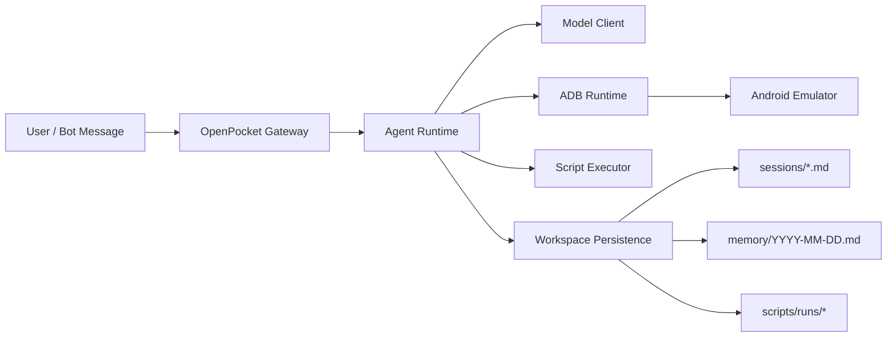

<section class="op-home-section">
  <h2>Why OpenPocket</h2>
  

    OpenPocket is built for teams that need deterministic phone automation without losing transparency.
    It keeps critical execution state on your machine, supports multiple model providers, and ships with
    practical controls for day-2 operations.
  

  

    CLI + Telegram Gateway
    Model Endpoint Fallback
    Script Allowlist + Timeout
    Cron + Heartbeat
    Native macOS Menu Bar Panel
  

</section>

<section class="op-home-section">
  <h2>Execution Model</h2>
  

    <article class="op-card">
      <h3>1. Route</h3>
      
CLI or Telegram input is routed into chat mode or task mode.

    </article>
    <article class="op-card">
      <h3>2. Observe</h3>
      
Runtime captures current app state and screenshot metadata from the emulator.

    </article>
    <article class="op-card">
      <h3>3. Decide</h3>
      
Model returns strict JSON action output with endpoint fallback support.

    </article>
    <article class="op-card op-card-wide">
      <h3>4. Execute</h3>
      
Action is applied via adb (or controlled script runner), then persisted in session + memory logs.

    </article>
    <article class="op-card op-card-wide">
      <h3>5. Operate</h3>
      
Gateway run-loop, heartbeat, and cron service keep long-running automation manageable.

    </article>
  

  

  

</section>

<section class="op-home-section">
  <h2>Documentation Map</h2>
  

    <a class="op-doc-link" href="/get-started/">
      <strong>Get Started</strong>
      Install, initialize, and onboard a local runtime quickly.
    </a>
    <a class="op-doc-link" href="/concepts/">
      <strong>Concepts</strong>
      Understand architecture, prompting, and persistence mechanics.
    </a>
    <a class="op-doc-link" href="/tools/">
      <strong>Tools</strong>
      Author and run skills/scripts with runtime-compatible conventions.
    </a>
    <a class="op-doc-link" href="/reference/">
      <strong>Reference</strong>
      Source-of-truth defaults, schemas, command surface, and formats.
    </a>
    <a class="op-doc-link" href="/ops/">
      <strong>Ops</strong>
      Day-2 runbook, troubleshooting, and operational guardrails.
    </a>
    <a class="op-doc-link" href="/hubs">
      <strong>Doc Hubs</strong>
      High-level documentation overview and scope policy.
    </a>
  

</section>
