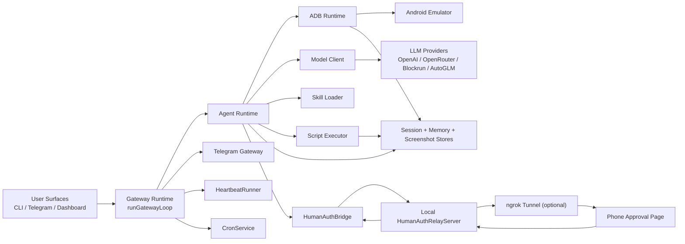

# Architecture

OpenPocket is a local-first phone-use runtime that executes automation on a local Android emulator and keeps state auditable on disk.

## End-to-End Topology

## Runtime Planes

- Control plane: `runGatewayLoop`, `TelegramGateway`, `HeartbeatRunner`, and `CronService` keep long-running operations stable.
- Intelligence plane: `AgentRuntime` + `ModelClient` produce next-step actions from multimodal context.
- Execution plane: `AdbRuntime` drives the local emulator and captures snapshots for each step.
- Persistence plane: sessions, memory, screenshots, and script artifacts are written under `OPENPOCKET_HOME`.
- Human-authorization plane: `HumanAuthBridge` blocks task progress when approval is required and resumes after a decision.

## Primary Task Loop

1. Receive task from CLI, Telegram, or dashboard.
2. Create session context and resolve model profile.
3. For each step, capture device state and ask the model for one normalized action.
4. Execute action through `adb` or `ScriptExecutor`.
5. Persist step output and optional screenshot artifacts.
6. Stop on `finish`, step limit, error, or explicit user stop.
7. Finalize session and append daily memory.

## Human Authorization Flow

1. Agent emits `request_human_auth` when blocked by real-device checks or sensitive checkpoints.
2. `HumanAuthBridge` creates a request on `HumanAuthRelayServer`.
3. Relay returns one-time approval URL and poll token.
4. Gateway sends the URL to Telegram.
5. User approves or rejects from phone browser.
6. Relay status is polled and mapped back to agent decision.
7. Agent resumes execution or exits based on decision.

Detailed token model and delegation payloads are in [Remote Human Authorization](./remote-human-authorization.md).

## Why Local Emulator

- No hosted cloud phone runtime is required.
- Your device control and artifacts remain local.
- Human and agent can hand off control on the same emulator session.

## Model Compatibility

Endpoint fallback order:

- Task loop (`ModelClient`): `chat` -> `responses` -> `completions`
- Chat assistant (`ChatAssistant`): `responses` -> `chat` -> `completions`

This keeps providers with partial endpoint support usable without changing user workflow.

## Current Extension Direction

- Richer remote controls beyond approval-only flows.
- Stronger long-horizon memory retrieval and compaction.
- More deterministic scenario-driven integration tests for gateway + human-auth + emulator loops.
