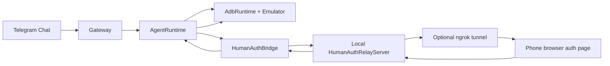
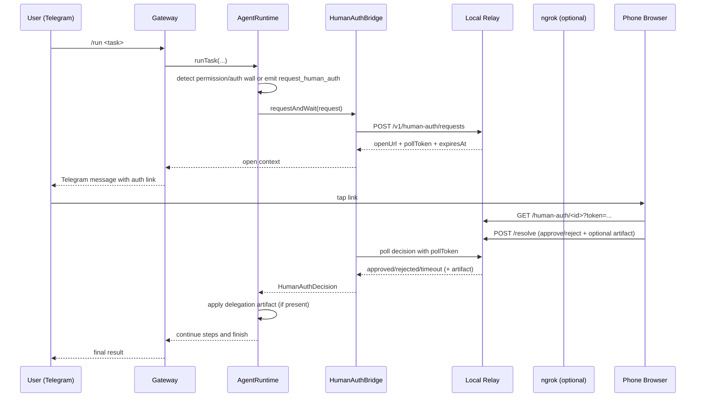

# Remote Human Authorization

This page documents the implemented remote authorization and delegation system used by OpenPocket today.

The design goal is:

- keep long-running automation in the local VM/emulator
- delegate real-device checkpoints to the user phone only when required
- resume VM flow with auditable, scoped data handoff

## Why This Exists

Many app flows cannot be completed only inside an emulator:

- runtime permissions that need human confirmation context
- identity checks (2FA, OTP, biometric-style confirmation)
- real-world inputs (camera image, QR text, live location)

OpenPocket handles this with a split architecture:

- VM side: continuous autonomous execution
- real phone side: explicit authorization and data delegation

## Architecture



## End-to-End Sequence



## Request and Token Model

Each remote auth request has:

- `requestId`
- `openToken` (used only by phone web page)
- `pollToken` (used only by runtime polling)
- `expiresAt`
- immutable context (`task`, `sessionId`, `step`, `capability`, `instruction`, `currentApp`)

Security characteristics:

- one-time scoped page token (`openTokenHash` stored server-side)
- separate poll channel token (`pollTokenHash`)
- timeout auto-resolution (`pending -> timeout`)
- optional relay API bearer auth (`humanAuth.apiKey` / `humanAuth.apiKeyEnv`)

## Delegation Artifact Types

Remote approval may include an optional artifact payload.

OpenPocket currently supports:

| Capability | Typical payload from phone | Runtime apply behavior |
| --- | --- | --- |
| `sms`, `2fa`, `qr`, `oauth`, `payment`, `biometric`, `notification`, `contacts`, `calendar`, `files`, `permission`, `unknown` | JSON `{ kind: "text" \| "qr_text", value }` | Auto `type` into focused input field |
| `location` | JSON `{ kind: "geo", lat, lon }` | `adb emu geo fix <lon> <lat>` injected to emulator |
| `camera`, `microphone`, `voice`, `nfc` (or any image path) | Image file (`.jpg/.png/.webp`) | Push to `/sdcard/Download/openpocket-human-auth-<ts>.<ext>` |

After image injection, runtime appends a deterministic hint into step history:

- `delegation_template=gallery_import_template: ...`

This allows the next model step to follow a stable upload path:

- open app upload/gallery picker
- navigate to `Downloads`
- choose injected OpenPocket file
- confirm

## Relay Modes

### Local relay only (LAN)

- `humanAuth.useLocalRelay=true`
- `humanAuth.tunnel.provider=none`
- phone must reach local network address

### Local relay + ngrok (remote phone access)

- `humanAuth.useLocalRelay=true`
- `humanAuth.tunnel.provider=ngrok`
- `humanAuth.tunnel.ngrok.enabled=true`
- `NGROK_AUTHTOKEN` (or config authtoken) available

Gateway startup auto-brings up local relay and tunnel when enabled.

## Telegram Integration

During blocked steps:

- gateway sends human-auth request summary
- includes one-tap web link when relay is reachable
- manual fallback commands always remain:
  - `/auth pending`
  - `/auth approve <request-id> [note]`
  - `/auth reject <request-id> [note]`

Gateway also emits `typing` heartbeat during long reasoning/execution so users see active progress in chat.

## Test Methodology

This section is an executable validation playbook for contributors and operators.

### 1) Preflight

```bash
openpocket config-show
openpocket telegram whoami
openpocket emulator status
openpocket gateway start
```

Checkpoints:

- Telegram token is valid and target chat is allowed.
- Emulator has at least one booted device.
- Gateway logs show local relay/tunnel readiness.

### 2) List PermissionLab scenarios

```bash
openpocket test permission-app cases
```

Expected scenario IDs:

- `camera`
- `microphone`
- `location`
- `contacts`
- `sms`
- `calendar`
- `photos`
- `notification`
- `2fa`

### 3) Run full E2E scenario

Use direct end-to-end command (recommended):

```bash
openpocket test permission-app run --case camera --chat <telegram_chat_id>
```

Alternative:

```bash
openpocket test permission-app task --case camera --send --chat <telegram_chat_id>
```

What should happen:

1. PermissionLab is built, installed, reset, and launched in emulator.
2. Agent taps the scenario button automatically.
3. Agent calls `request_human_auth` when blocked.
4. Telegram receives human-auth message with clickable link.
5. User approves/rejects (optionally attaches text/geo/photo).
6. Agent resumes and reports outcome.

### 4) Validate delegation application

Inspect session output:

```bash
ls -t ~/.openpocket/workspace/sessions | head -n 1
```

Open latest session and verify `execution_result` includes expected lines:

- `Human auth approved|rejected|timeout request_id=...`
- optional `human_artifact=...`
- optional `delegation_result=...`
- optional `delegation_template=gallery_import_template: ...`

Location delegation validation:

- session contains `delegated location injected lat=... lon=...`

Image delegation validation:

- session contains `delegated image pushed to /sdcard/Download/...`
- later model step uses gallery/import flow path

### 5) Failure drills

Run the same scenario while intentionally creating faults:

- stop ngrok session to verify fallback behavior
- reject request from phone
- let request timeout

Expected system behavior:

- task does not hang forever
- decision is surfaced in session + Telegram
- manual `/auth` commands can still resolve pending requests

## Operational Observability

Primary runtime artifacts:

- relay request state: `state/human-auth-relay/requests.json`
- uploaded artifacts: `state/human-auth-artifacts/`
- task execution trace: `workspace/sessions/session-*.md`
- human-auth logs: gateway stdout lines containing `[OpenPocket][human-auth]`

## Current Limits

- Browser permission handling differs across Telegram in-app browsers and mobile OS versions.
- Some app-specific permission walls may require custom action heuristics after delegation.
- ngrok free plan allows only one active agent session; duplicate sessions can break link generation.

## Recommended Production Baseline

- Keep relay local-first and avoid centralized backend requirement.
- Use ngrok only as a connectivity layer, not data persistence.
- Keep relay API key enabled when exposing public URL.
- Regularly prune old artifacts from `state/human-auth-artifacts/`.
