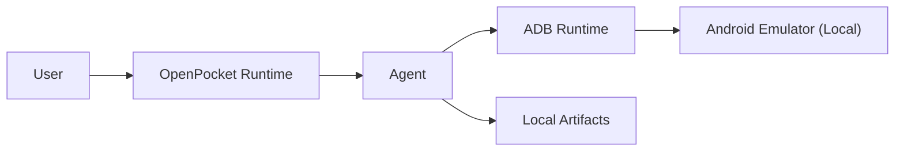

<section class="op-home-section op-centered">
  <h2>OpenPocket in One Line</h2>
  

    OpenPocket helps users automate real mobile app tasks without sending execution control to a cloud phone runtime.
  

  

    Shopping
    Entertainment
    Social Workflows
  

</section>

<section class="op-home-section op-centered">
  <h2>How It Moves</h2>
  

    <article class="op-card">
      <h3>1. Ask</h3>
      
Start from CLI, bot, or local panel.

    </article>
    <article class="op-card">
      <h3>2. Plan</h3>
      
Agent chooses the next mobile action.

    </article>
    <article class="op-card">
      <h3>3. Act</h3>
      
OpenPocket executes on your local emulator.

    </article>
  

  

  

</section>

<section class="op-home-section op-doc-map-section op-centered">
  

    
Documentation

    <h2>Documentation Map</h2>
    
Pick one entry and dive deeper.

  

  

    <a class="op-doc-link" :href="withBase('/get-started/')">
      Start
      <strong>Get Started</strong>
      Install and run OpenPocket quickly.
    </a>
    <a class="op-doc-link" :href="withBase('/concepts/project-blueprint')">
      Vision
      <strong>Project Blueprint</strong>
      Product direction and user scenarios.
    </a>
    <a class="op-doc-link" :href="withBase('/concepts/')">
      System
      <strong>Concepts</strong>
      Architecture and core runtime model.
    </a>
    <a class="op-doc-link" :href="withBase('/tools/')">
      Build
      <strong>Tools</strong>
      Skills and scripts for automation.
    </a>
    <a class="op-doc-link" :href="withBase('/reference/')">
      Specs
      <strong>Reference</strong>
      Defaults, schemas, and commands.
    </a>
    <a class="op-doc-link" :href="withBase('/ops/')">
      Operate
      <strong>Ops</strong>
      Runbook and troubleshooting guidance.
    </a>
    <a class="op-doc-link" :href="withBase('/hubs')">
      Overview
      <strong>Doc Hubs</strong>
      Browse the full documentation structure.
    </a>
  

</section>
