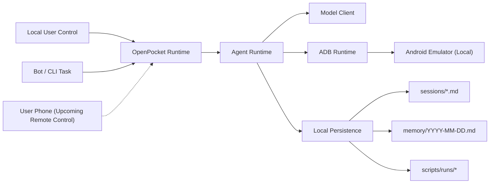

<section class="op-home-section">
  <h2>Why OpenPocket</h2>
  

    OpenPocket is built for real life mobile automation, not only developer productivity.
    It helps users complete practical app tasks locally while keeping control, visibility,
    and auditability.
  

  

    Shopping
    Entertainment
    Social Workflows
    Local Emulator Runtime
    Human-in-the-Loop
  

</section>

<section class="op-home-section">
  <h2>Execution Model</h2>
  

    <article class="op-card">
      <h3>1. Request</h3>
      
User sends a task from CLI, bot, or local operations panel.

    </article>
    <article class="op-card">
      <h3>2. Observe</h3>
      
Runtime captures local emulator state and contextual screenshot data.

    </article>
    <article class="op-card">
      <h3>3. Decide</h3>
      
Agent plans the next action through configured model profiles.

    </article>
    <article class="op-card op-card-wide">
      <h3>4. Execute</h3>
      
Actions are applied to the local Android emulator via adb with audit logs.

    </article>
    <article class="op-card op-card-wide">
      <h3>5. Review and Continue</h3>
      
Users can intervene, inspect artifacts, and continue in a shared human-agent loop.

    </article>
  

  

  

</section>

<section class="op-home-section">
  <h2>Control Modes</h2>
  

    <article class="op-card">
      <h3>Direct Human Control</h3>
      
Users can manually control the local emulator for sensitive or high-context steps.

    </article>
    <article class="op-card">
      <h3>Agent Control</h3>
      
The agent executes mobile actions on the same local runtime for repeatable flows.

    </article>
    <article class="op-card op-card-wide">
      <h3>Upcoming: Phone Remote Human-in-the-Loop</h3>
      
Planned support lets users connect from their own phone to supervise and control the local emulator remotely.

    </article>
  

</section>

<section class="op-home-section op-doc-map-section">
  

    
Explore

    <h2>Documentation Map</h2>
    
Choose your path based on where you are right now: first setup, product understanding, implementation details, or operations.

  

  

    <a class="op-doc-link" :href="withBase('/get-started/')">
      Start Here
      <strong>Get Started</strong>
      Install and run your local emulator-first runtime.
      Open Guide
    </a>
    <a class="op-doc-link" :href="withBase('/concepts/project-blueprint')">
      Product
      <strong>Project Blueprint</strong>
      Read the full product direction and operating model.
      Read Vision
    </a>
    <a class="op-doc-link" :href="withBase('/concepts/')">
      System
      <strong>Concepts</strong>
      Understand architecture, prompting, and persistence behavior.
      View Concepts
    </a>
    <a class="op-doc-link" :href="withBase('/tools/')">
      Builder
      <strong>Tools</strong>
      Author and run skills/scripts with runtime-compatible conventions.
      Open Tools
    </a>
    <a class="op-doc-link" :href="withBase('/reference/')">
      Specs
      <strong>Reference</strong>
      Source-of-truth defaults, schemas, command surface, and formats.
      Open Reference
    </a>
    <a class="op-doc-link" :href="withBase('/ops/')">
      Operations
      <strong>Ops</strong>
      Day-2 runbook, troubleshooting, and operational guardrails.
      Open Runbook
    </a>
    <a class="op-doc-link" :href="withBase('/get-started/deploy-docs')">
      Publish
      <strong>Deploy Docs</strong>
      Publish this documentation site on Vercel.
      Deploy
    </a>
    <a class="op-doc-link" :href="withBase('/hubs')">
      Overview
      <strong>Doc Hubs</strong>
      Browse the complete documentation structure.
      Browse All
    </a>
  

</section>
